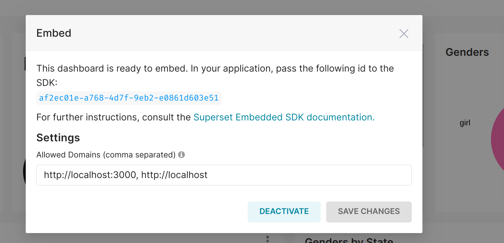

# Steps

## 1.Enable the embed dashboard option.

```sh
   $ cd superset/docker/pythonpath_dev/superset_config.py
   FEATURE_FLAGS = {"ALERT_REPORTS": True, "EMBEDDED_SUPERSET": True}
```

## 2.Start Superset

```sh
   $ docker-compose -f docker-compose-non-dev.yml up
```
## 3. Enable embedding on specific Dashboard and set the allowed domain.

        

## 4.Create a user and assign them GAMMA and PUBLIC roles.


## 5. Create a backend project that will handle authentication and serving dashboard to the frontend.
   
```sh
   $ sudo apt install npm  # Install Node JS
   $ clone superset-embed-backend
   $ cd superset-embed-backend
   $ node index.js # Run our code.
   
```
   
## 6. Create frontend react application.
   
```sh
   
   $ clone superset-embed-frontend
   $ npm i @superset-ui/embedded-sdk  # install the superset embedding sdk
   $ cd superset-embed-frontend
   $ npm start # run the application
   $ http://localhost:3000/ # Access application
   
```
   

